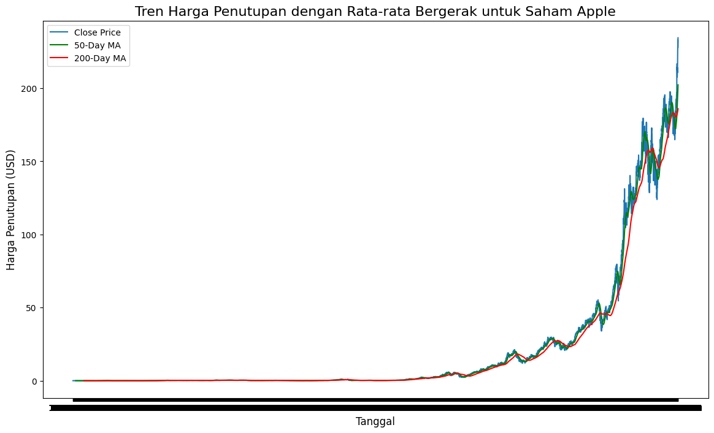

# Laporan Proyek Machine Learning - Dwi Krisnandi

## Domain Proyek
Domain : Ekonomi, Keuangan.
Saat kita melihat informasi tentang berapa harga saham, ada beberapa hal yang perlu kita pikirkan. Terkadang, sulit untuk menebak berapa harga di masa mendatang karena harga dapat naik dan turun drastis, dan hal-hal lain dapat mengubah seberapa besar keinginan orang untuk membeli atau menjual saham. Oleh sebab itu mengapa saya membahas masalah ini dan bagaimana kita dapat mencoba menyelesaikannya.

Terkadang, harga saham Apple naik dan turun, sama seperti perusahaan teknologi lainnya. Penting untuk mengetahui mengapa hal ini terjadi sehingga kita dapat memahami bagaimana harga dapat berubah di masa mendatang. Dengan cara ini, orang yang membeli dan menjual saham dapat membuat pilihan yang lebih cerdas.

Berita tentang keuangan, pendapatan perusahaan, dan aturan baru dari pemerintah dapat mengubah berapa harga saham. Jika orang memahami bagaimana hal-hal ini saling terkait, mereka dapat menebak dengan lebih baik apakah harga saham akan naik atau turun.

Pemodelan prediktif seperti mencoba menebak apa yang akan terjadi pada harga saham di masa mendatang. Untuk membuat tebakan ini, kita melihat informasi dari masa lalu, seperti mempelajari pekerjaan rumah lama untuk mendapatkan hasil yang lebih baik pada ujian baru. Setelah kita membuat tebakan, kita memeriksanya dengan informasi baru yang belum pernah kita lihat sebelumnya untuk melihat apakah tebakan kita benar.

Analisis Sentimen seperti pekerjaan detektif di mana kita melihat apa yang dikatakan orang-orang di berita dan di media sosial untuk mengetahui bagaimana perasaan mereka tentang berbagai hal. Ini membantu kita memahami apakah perasaan tersebut dapat mengubah harga saham, yang seperti bagian kecil dari perusahaan yang dapat dibeli atau dijual orang. Jadi, jika banyak orang senang dengan suatu perusahaan, harga sahamnya mungkin naik, dan jika mereka tidak senang, harga sahamnya mungkin turun.

## Business Understanding
### 1. Problem Statements (Pernyataan Masalah)
Saham Apple (AAPL) memiliki volatilitas yang tinggi dan dipengaruhi oleh berbagai faktor eksternal, termasuk berita ekonomi, laporan pendapatan, dan perubahan kebijakan pemerintah. Akibatnya, banyak investor kesulitan dalam memprediksi pergerakan harga saham dan mengoptimalkan portofolio mereka. Dalam konteks ini, masalah yang perlu diatasi adalah:
- Kesulitan dalam Memahami Pola Harga: Banyak investor dan analis tidak dapat mengidentifikasi pola harga saham Apple dengan efektif menggunakan data historis.
- Volatilitas dan Ketidakpastian: Volatilitas yang tinggi dalam harga saham menyebabkan ketidakpastian, membuat keputusan investasi menjadi sulit.
- Pengaruh Berita terhadap Harga: Berita dan peristiwa eksternal sering kali mempengaruhi harga saham, tetapi banyak yang tidak tahu bagaimana mengukur dampaknya secara kuantitatif.

### 2. Goals (Tujuan)
Untuk mengatasi pernyataan masalah di atas, tujuan analisis ini dapat dirumuskan sebagai berikut:

1. Mengidentifikasi Pola dan Tren Historis
Menganalisis data historis untuk menemukan pola dan tren yang dapat digunakan untuk memprediksi harga saham di masa depan. Ini termasuk menggunakan teknik statistik dan visualisasi data untuk memahami pergerakan harga.

2. Membangun Model Prediktif
Mengembangkan model prediktif yang dapat digunakan untuk memproyeksikan harga saham Apple berdasarkan data historis. Model ini harus dapat memberikan estimasi harga yang akurat dan dapat diandalkan.

3. Menyediakan Rekomendasi Investasi
Berdasarkan hasil analisis, memberikan rekomendasi investasi yang dapat membantu investor dalam pengambilan keputusan yang lebih baik terkait saham Apple.


## Data Understanding

### Informasi Umum

Dataset ini berisi data harian saham Apple (AAPL) dari tahun 1980 hingga 2020. Dataset ini diambil dari Yahoo Finance dan diunggah ke Kaggle. Berikut adalah informasi lebih lanjut mengenai dataset ini:

- **Jumlah Data**: 10,987 baris
- **Kondisi Data**: Terdapat 7 kolom dengan semua kolom memiliki nilai non-null. Tidak ada nilai yang hilang dalam dataset ini.
- **Sumber Data**: [Apple Stock Data on Kaggle](https://www.kaggle.com/datasets/krupalpatel07/apple-stock-data)

### Variabel/Fitur dalam Dataset

Dataset ini terdiri dari beberapa fitur yang penting untuk analisis saham, sebagai berikut:
1. **Unnamed: 0**: Indeks dari data (tipe data: integer).
2. **Date**: Tanggal perdagangan (tipe data: objek).
3. **Open**: Harga pembukaan saham Apple pada tanggal tersebut (tipe data: float).
4. **High**: Harga tertinggi saham Apple pada tanggal tersebut (tipe data: float).
5. **Low**: Harga terendah saham Apple pada tanggal tersebut (tipe data: float).
6. **Close**: Harga penutupan saham Apple pada tanggal tersebut (tipe data: float).
7. **Volume**: Jumlah saham yang diperdagangkan pada tanggal tersebut (tipe data: integer).


### Analisis Data

Untuk memahami data lebih lanjut, beberapa teknik eksplorasi dan visualisasi yang dapat dilakukan antara lain:

#### Visualisasi Data

##### a. Visualisasi Harga Penutupan
Pada bagian ini, kita memuat dataset dan menampilkan grafik harga penutupan saham AAPL.


##### b. Distribusi Volume Perdagangan
Pada bagian ini, kita memuat dataset dan menampilkan grafik tren distribusi perdagangan saham AAPL.


##### c. Moving Average
menghitung dan memplot rata-rata bergerak 50 hari dan 200 hari untuk melihat tren jangka pendek dan jangka panjang. Rata-rata bergerak membantu mengidentifikasi arah tren dan mencegah kebingungan akibat fluktuasi jangka pendek. Jika rata-rata bergerak 50 hari melampaui rata-rata 200 hari, ini bisa menunjukkan potensi tren bullish.


## PRAPEMROSESAN DATA
Pada tahap ini, kita melakukan praproses pada data, termasuk penggeseran data untuk membuat fitur dan label yang sesuai. Data kemudian dibagi menjadi set pelatihan dan pengujian.
```
# Preprocessing for machine learning models
data_ml = data[['Close']]

# Feature Engineering: Using previous days as features for regression models
data_ml['Close_shifted'] = data_ml['Close'].shift(1)
data_ml.dropna(inplace=True)

# Splitting the data into training and test sets
train, test = train_test_split(data_ml, test_size=0.2, shuffle=False)

# Separate features and labels
X_train, y_train = train[['Close_shifted']], train['Close']
X_test, y_test = test[['Close_shifted']], test['Close']

# Scale data for machine learning models
scaler = MinMaxScaler()
X_train_scaled = scaler.fit_transform(X_train)
X_test_scaled = scaler.transform(X_test)
```

## Modeling
### 1. Linear Regression
#### Tahapan Proses Pemodelan
- Scaling dilakukan untuk menstandarisasi fitur pada data agar berada dalam rentang yang sama, sehingga setiap fitur memiliki pengaruh yang seimbang dalam proses pemodelan. Scaling umumnya digunakan ketika model berbasis jarak atau berbobot seperti regresi linear digunakan.
- Model Linear Regression dilatih menggunakan data latih (X_train_scaled) dan target yang sesuai (y_train). Tujuannya adalah agar model mempelajari hubungan linear antara fitur dan variabel target.
- Setelah model dilatih, model digunakan untuk melakukan prediksi pada data uji (X_test_scaled) dan menghasilkan nilai prediksi (y_pred_lr). Nilai prediksi ini akan dibandingkan dengan nilai sebenarnya (y_test) untuk mengukur performa model.
#### Parameter yang Digunakan
- X_train_scaled dan X_test_scaled: Merupakan data fitur yang telah dinormalisasi atau distandardisasi, bertujuan untuk memastikan bahwa variabel fitur berada dalam skala yang sama sehingga tidak ada fitur yang mendominasi yang lain.
- y_train: Target atau nilai yang ingin diprediksi berdasarkan data latih.
- lr: Objek dari kelas LinearRegression yang mewakili model regresi linear.
- y_pred_lr: Hasil prediksi dari model terhadap data uji setelah dilatih dengan data latih.
#### Kelebihan Linear Regression
- Sederhana dan Mudah Dipahami
Regresi linear merupakan algoritma yang mudah diimplementasikan dan hasilnya mudah untuk ditafsirkan.

- Efisiensi Komputasi
Algoritma ini cukup cepat untuk dijalankan, bahkan untuk dataset yang besar, karena hanya memerlukan komputasi dasar (perkalian matriks).

- Model Dasar yang Solid
Meskipun sederhana, model ini dapat digunakan sebagai baseline yang baik untuk melihat performa model dasar sebelum mencoba algoritma yang lebih kompleks.

- Hubungan Linear yang Jelas
Algoritma ini efektif digunakan ketika hubungan antara variabel independen dan variabel target bersifat linear.
#### Kekurangan Linear Regression
- Asumsi Hubungan Linear
Kelemahan utama dari regresi linear adalah asumsi bahwa hubungan antara variabel independen dan dependen adalah linear. Jika hubungan sebenarnya tidak linear, model ini mungkin tidak memberikan hasil yang akurat.

- Peka terhadap Outlier
Regresi linear sangat peka terhadap outlier, yaitu data yang nilainya jauh dari nilai rata-rata, karena outlier dapat secara signifikan mempengaruhi hasil prediksi.

- Overfitting
Jika jumlah fitur jauh lebih banyak dibandingkan dengan jumlah data (dimensionality problem), model ini cenderung mengalami overfitting, terutama tanpa regularisasi.

- Tidak Bisa Menangani Multikolinearitas
Jika ada korelasi tinggi antara fitur (multikolinearitas), model akan mengalami kesulitan untuk menentukan mana fitur yang berpengaruh kuat terhadap variabel target.

### 2. Random Forest Regression
#### Tahapan Proses Pemodelan
- Data fitur (X_train dan X_test) distandardisasi terlebih dahulu sehingga setiap fitur berada dalam skala yang sama. Ini penting untuk menjaga proporsi fitur dan menghindari fitur dengan skala yang lebih besar mendominasi proses pemodelan.
- Model Random Forest Regressor dibangun dengan parameter n_estimators=100, yang berarti model akan membentuk 100 pohon keputusan (decision trees) dan menggabungkan prediksinya. Setiap pohon dalam hutan dibangun menggunakan subset acak dari data latih.
- Model dilatih dengan data latih yang telah diskalakan (X_train_scaled) dan target sebenarnya (y_train). Random Forest menggunakan teknik bagging di mana setiap pohon dilatih pada subset acak dari data dan fitur untuk meningkatkan generalisasi dan mencegah overfitting.
- Setelah dilatih, model melakukan prediksi pada data uji yang juga telah diskalakan (X_test_scaled). Hasil prediksi (y_pred_rf) adalah rata-rata dari hasil prediksi dari setiap pohon keputusan di dalam hutan.
#### Parameter yang Digunakan
- n_estimators=100: Menentukan jumlah pohon keputusan (decision trees) dalam model Random Forest. Semakin banyak pohon, semakin stabil prediksi karena rata-rata prediksi dari semua pohon diambil.
- X_train_scaled dan X_test_scaled: Data fitur yang telah distandardisasi atau dinormalisasi untuk memastikan semua fitur berada dalam skala yang sama.
- y_train: Target atau nilai aktual dari data latih.
- y_pred_rf: Hasil prediksi model setelah diterapkan pada data uji.
#### Kelebihan Random Forest Regression
- Kemampuan untuk Menangani Data yang Kompleks
Random Forest dapat menangani hubungan non-linear antar fitur dengan baik, berbeda dengan regresi linear yang mengasumsikan hubungan linear.

- Mengurangi Overfitting
Teknik bagging yang digunakan oleh Random Forest membantu mengurangi risiko overfitting, karena setiap pohon dilatih pada subset data yang berbeda. Sehingga model menjadi lebih robust terhadap noise pada data.

- Tahan Terhadap Outlier
Berbeda dengan regresi linear, Random Forest tidak terlalu sensitif terhadap outlier karena setiap pohon hanya menggunakan sebagian data, dan outlier mungkin tidak selalu menjadi bagian dari setiap pohon.

- Dapat Menangani Data dengan Dimensi yang Tinggi
Random Forest bisa bekerja dengan baik meskipun data memiliki banyak fitur (dimensi tinggi) tanpa harus melakukan seleksi fitur secara eksplisit.

- Estimasi Pentingnya Fitur
Algoritma Random Forest dapat memberikan peringkat pentingnya fitur berdasarkan seberapa banyak mereka berkontribusi terhadap prediksi, sehingga dapat membantu dalam melakukan analisis lebih lanjut.
#### Kekurangan Random Forest Regression
- Waktu Komputasi yang Lama
Karena model membangun banyak pohon (misalnya 100), proses training dan prediksi bisa menjadi lebih lambat dibandingkan dengan model yang lebih sederhana, terutama ketika bekerja dengan dataset yang besar.

- Model yang Kompleks dan Tidak Transparan
Meskipun hasil dari Random Forest biasanya akurat, model ini merupakan black-box sehingga sulit untuk ditafsirkan atau dijelaskan secara mendalam (tidak seperti regresi linear yang memberikan hubungan langsung antar variabel).

- Tidak Cocok untuk Ekstrapolasi
Random Forest biasanya tidak bisa memprediksi nilai di luar rentang nilai yang telah dilatih. Ini membuatnya kurang efektif untuk kasus-kasus di mana diperlukan prediksi yang di luar cakupan data latih.

- Memori yang Dibutuhkan
Model ini dapat membutuhkan memori yang besar karena harus menyimpan banyak pohon keputusan di dalamnya, terutama ketika bekerja dengan dataset yang besar.

### 3. ARIMA
#### Tahapan Proses Pemodelan
- Persiapan Data 
Data yang digunakan (dalam hal ini adalah harga penutupan, train['Close']) perlu dalam format time series. Pastikan bahwa data tersebut tidak mengandung missing values dan telah diindeks dengan waktu yang tepat.

- Mendefinisikan Model ARIMA (model_arima = ARIMA(train['Close'], order=(1,1,3))) 
Model ARIMA dibangun dengan parameter order yang terdiri dari tiga komponen:
   -  p (AutoRegressive Order): Jumlah lag dari variabel dependen (dalam hal ini, harga penutupan) yang digunakan untuk memprediksi nilai saat ini. Di sini, p = 1.
   - d (Integrated Order): Jumlah diferensiasi yang diperlukan untuk membuat data menjadi stasioner. Di sini, d = 1, yang berarti data telah mengalami satu kali diferensiasi.
   - q (Moving Average Order): Jumlah lag dari kesalahan prediksi sebelumnya yang digunakan dalam model. Di sini, q = 3.

- Melatih Model (model_arima_fit = model_arima.fit())
Model ARIMA yang telah didefinisikan kemudian dilatih menggunakan data latih. Proses ini akan memperkirakan parameter yang terbaik untuk model berdasarkan data yang diberikan.

- Prediksi (y_pred_arima = model_arima_fit.forecast(steps=len(test)))
Setelah model dilatih, dilakukan prediksi untuk langkah ke depan sesuai dengan panjang data uji (test). Fungsi forecast() digunakan untuk menghasilkan nilai prediksi dari model yang telah dilatih.
#### Parameter yang Digunakan
- train['Close']: Merupakan data time series yang digunakan untuk melatih model. Dalam konteks ini, ini adalah harga penutupan.
- order=(1,1,3): Parameter yang menentukan struktur model ARIMA:
  - p = 1: Satu lag dari harga penutupan yang digunakan untuk memprediksi nilai saat ini.
  - d = 1: Satu kali diferensiasi untuk mencapai stasionaritas.
  - q = 3: Tiga lag dari kesalahan untuk memodelkan hubungan kesalahan.
- model_arima_fit: Objek dari model ARIMA yang telah dilatih dengan data latih.
- y_pred_arima: Hasil prediksi dari model ARIMA untuk langkah ke depan berdasarkan data uji.
#### Kelebihan ARIMA
- Kemampuan Menangani Data Time Series 
ARIMA dirancang khusus untuk analisis dan peramalan data time series, sehingga cocok untuk masalah yang melibatkan data yang tergantung pada waktu.

- Fleksibilitas dalam Model
Dengan tiga parameter (p, d, q), ARIMA memberikan fleksibilitas dalam menangkap berbagai pola dan struktur dalam data time series.

- Stasionaritas 
Dengan menggunakan diferensiasi (parameter d), ARIMA dapat menangani non-stasionaritas dalam data, yang merupakan aspek penting dalam pemodelan time series.

- Model Sederhana
Meskipun mungkin terlihat kompleks, struktur ARIMA relatif sederhana dan mudah untuk diimplementasikan.
#### Kekurangan ARIMA
- WAsumsi Stasionaritas
ARIMA mengharuskan data untuk menjadi stasioner. Jika data tidak dapat diubah menjadi stasioner melalui diferensiasi, maka model ini tidak akan memberikan hasil yang baik.

- Keterbatasan dalam Menangkap Pola Musiman
ARIMA tidak dapat menangkap pola musiman dengan baik. Untuk data yang memiliki pola musiman, model SARIMA (Seasonal ARIMA) lebih sesuai.

- Pemilihan Parameter yang Rumit
Pemilihan parameter yang tepat (p, d, q) bisa menjadi rumit dan memerlukan pemahaman yang baik tentang data serta analisis grafik (seperti ACF dan PACF).

- Sensitivitas terhadap Outlier
ARIMA dapat menjadi sensitif terhadap outlier dalam data, yang dapat mempengaruhi hasil prediksi.

### 3. LSTM
#### Tahapan Proses Pemodelan
- Persiapan Data
Data yang digunakan (dalam hal ini adalah harga penutupan, data[['Close']]) diambil dalam bentuk array. Data ini merupakan data time series yang akan diprediksi.

- Scaling untuk LSTM (MinMaxScaler)
Data di-scaling menggunakan MinMaxScaler untuk membawa nilai ke dalam rentang [0, 1]. Ini penting dalam LSTM untuk mempercepat konvergensi dan menghindari masalah numerik.

- Mempersiapkan Dataset untuk LSTM
  - Dataset disiapkan dengan menciptakan X_lstm dan y_lstm. Dalam hal ini, untuk setiap 60 nilai sebelumnya dari data terukur, model akan memprediksi nilai selanjutnya. Ini dilakukan dengan loop yang mengisi array dengan data yang sesuai:
    ```
    python
    For i in range(60, len(train_scaled)):
        X_lstm.append(train_scaled[i-60:i, 0])
        y_lstm.append(train_scaled[i, 0])
    ```
  - Reshape Data: Setelah itu, bentuk data X_lstm diubah agar sesuai dengan input yang diharapkan oleh LSTM, yaitu (samples, time steps, features).

- Membangun Model LSTM
Model LSTM dibangun menggunakan Sequential dari Keras. Struktur model adalah sebagai berikut:
  - LSTM Layer 1: Menambahkan layer LSTM pertama dengan 50 unit dan pengaturan return_sequences=True untuk memungkinkan layer berikutnya menerima output dari layer ini.
  - LSTM Layer 2: Layer LSTM kedua tanpa pengaturan return_sequences.
  - Dense Layer 1: Layer Dense dengan 25 unit.
  - Output Layer: Layer Dense dengan 1 unit untuk menghasilkan prediksi nilai harga penutupan.

- Komplikasi Model (Compile)
Model dikompilasi dengan menggunakan optimizer Adam dan loss function mean_squared_error untuk mengukur seberapa baik model memprediksi data.

- Menambahkan Early Stopping
EarlyStopping digunakan untuk mencegah overfitting dengan menghentikan pelatihan jika tidak ada peningkatan dalam loss selama 5 epoch.

- Melatih Model (Fit)
Model dilatih pada dataset yang sudah dipersiapkan dengan 50 epoch dan batch size 64, serta menggunakan callback early stopping.

- Prediksi menggunakan LSTM
Setelah model dilatih, dilakukan prediksi dengan data uji yang diambil dari 60 nilai terakhir dari data asli. Data tersebut juga di-scaling agar sesuai dengan format yang digunakan dalam model. Selanjutnya, hasil prediksi di-inverse transform untuk mengembalikan ke skala asli.
#### Parameter yang Digunakan
- train_set: Dataset yang digunakan untuk melatih model, dalam hal ini adalah harga penutupan.
- MinMaxScaler: Mengubah rentang data ke dalam interval [0, 1].
- X_lstm dan y_lstm: Fitur dan target yang disiapkan untuk pelatihan model. X_lstm berisi 60 langkah waktu dari data terukur untuk prediksi.
- units: Menunjukkan jumlah unit dalam setiap layer LSTM (50 untuk layer pertama dan kedua).
- epochs: Jumlah epoch untuk melatih model, di sini diatur ke 50.
- batch_size: Ukuran batch untuk pelatihan, diatur ke 64.
- EarlyStopping: Callback untuk menghentikan pelatihan jika tidak ada peningkatan loss.
- y_pred_lstm: Hasil prediksi model pada data uji setelah model dilatih.
#### Kelebihan LSTM
- Kemampuan Menangani Data Time Series
LSTM dirancang untuk mengatasi masalah yang melibatkan urutan data dan sangat baik dalam menangkap dependensi temporal dalam data time series.

- Memori Jangka Panjang
LSTM memiliki kemampuan untuk menyimpan informasi untuk periode waktu yang panjang, yang sangat bermanfaat untuk data yang memiliki hubungan jangka panjang.

- Fleksibilitas Model
LSTM dapat menangani data yang memiliki pola musiman atau tren yang rumit, yang mungkin sulit dilakukan oleh model linear.

- Tahan terhadap vanishing gradient
Arsitektur LSTM dirancang untuk mengatasi masalah vanishing gradient yang sering terjadi dalam jaringan saraf tradisional, memungkinkan pelatihan yang lebih dalam dan efektif.
#### Kekurangan LSTM
- Kompleksitas Model
LSTM merupakan model yang lebih kompleks dibandingkan dengan algoritma lain, sehingga membutuhkan lebih banyak data dan waktu untuk pelatihan.

- Waktu Pelatihan yang Lama
Karena kompleksitasnya, LSTM sering kali memerlukan waktu pelatihan yang lebih lama, terutama pada dataset yang besar.

- Tuning Hyperparameter
LSTM memiliki banyak hyperparameter yang perlu disetel, seperti jumlah unit, jumlah layer, ukuran batch, dan lainnya, yang bisa menjadi tantangan.

- Overfitting
Meskipun LSTM dapat menangani banyak data, model yang terlalu besar dapat mengalami overfitting jika tidak dikendalikan dengan baik (misalnya dengan regularisasi atau early stopping).

## Evaluation
### Metrik yang Digunakan
1. Mean Squared Error (MSE)
  - MSE mengukur rata-rata kuadrat perbedaan antara nilai yang diprediksi oleh model dan nilai aktual. Metrik ini memberikan bobot lebih pada kesalahan yang lebih besar, sehingga memberikan gambaran yang lebih jelas tentang seberapa besar kesalahan prediksi.
  - Mean Squared Error (MSE) dapat dinyatakan dengan rumus:
    $$
    \text{MSE} = \frac{1}{n} \sum_{i=1}^{n} (y_i - \hat{y}_i)^2
    $$
  - Di mana:
    - $y_i$ adalah nilai aktual
    - $\hat{y}_i$ adalah nilai prediksi

2. R-squared (R²)
  - R-squared adalah metrik yang menunjukkan seberapa baik model menjelaskan variasi dalam data. Nilai R² berkisar antara 0 dan 1, di mana nilai yang lebih tinggi menunjukkan bahwa model menjelaskan proporsi yang lebih besar dari variasi data. Nilai negatif menunjukkan bahwa model tidak mampu menjelaskan variabilitas data lebih baik daripada model rata-rata.
  - R-squared ($R^2$) dapat dihitung dengan rumus:
        $$
        R^2 = 1 - \frac{\text{SS}_{\text{res}}}{\text{SS}_{\text{tot}}}
        $$
  - Di mana:
        - $\text{SS}_{\text{res}}$ adalah jumlah kuadrat sisa (residual sum of squares)
        - $\text{SS}_{\text{tot}}$ adalah jumlah kuadrat total

### Hasil Proyek Berdasarkan Metrik Evaluasi
#### Mean Squared Error (MSE)
- Linear Regression MSE: 3.82
Linear Regression memiliki MSE terendah, menunjukkan bahwa model ini memberikan prediksi yang paling akurat di antara semua model yang diuji.

- Random Forest MSE: 7660.94
Random Forest memiliki MSE yang jauh lebih tinggi, menunjukkan bahwa prediksi model ini kurang akurat dibandingkan dengan Linear Regression.

- ARIMA MSE: 8218.14
MSE ARIMA juga cukup tinggi, mengindikasikan performa model yang kurang baik dalam memprediksi data.

- LSTM MSE: 5.81
LSTM memiliki MSE yang rendah, tetapi sedikit lebih tinggi dari Linear Regression, menunjukkan bahwa meskipun LSTM efektif, tidak seakurat Linear Regression dalam konteks ini.

#### R-squared (R²)
- Linear Regression R-squared: 0.999
Nilai R² yang sangat tinggi menunjukkan bahwa Linear Regression menjelaskan hampir semua variasi dalam data. Ini menunjukkan bahwa model ini sangat baik dalam memprediksi nilai yang akan datang.

- Random Forest R-squared: -1.15
Nilai R² negatif menunjukkan bahwa model Random Forest tidak mampu menjelaskan variasi dalam data lebih baik daripada model rata-rata, menunjukkan performa yang sangat buruk.

- ARIMA R-squared: -1.31
Sama halnya dengan Random Forest, ARIMA juga tidak mampu menjelaskan variasi dalam data, yang menunjukkan bahwa model ini tidak cocok untuk data ini.

- LSTM R-squared: 0.998
R² LSTM juga menunjukkan performa yang baik, meskipun tidak sebaik Linear Regression. Ini menunjukkan bahwa LSTM mampu menjelaskan sebagian besar variasi dalam data, tetapi ada beberapa kesalahan prediksi yang perlu diperhatikan.

#### Kesimpulan
Berdasarkan MSE dan R-squared, Linear Regression muncul sebagai model paling efektif untuk memprediksi data harga penutupan, memberikan kombinasi terbaik antara akurasi dan kemampuan menjelaskan variabilitas data. Sebaliknya, Random Forest dan ARIMA menunjukkan performa yang buruk, dengan R² negatif, menandakan bahwa kedua model tersebut tidak efektif untuk data ini. LSTM, meskipun memiliki performa yang baik, tetap tidak mengungguli Linear Regression dalam hal akurasi prediksi, yang menunjukkan bahwa model ini mungkin lebih kompleks dari yang diperlukan untuk data yang sedang dianalisis.

# Grafik hasil prediksi vs aktual
LSTM


Linear Regresion


ARIMA


Random Forest
